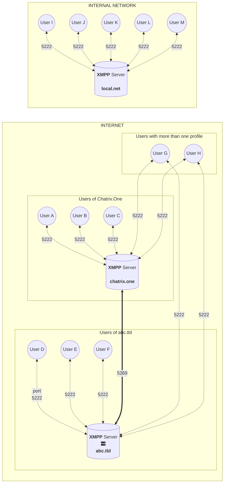
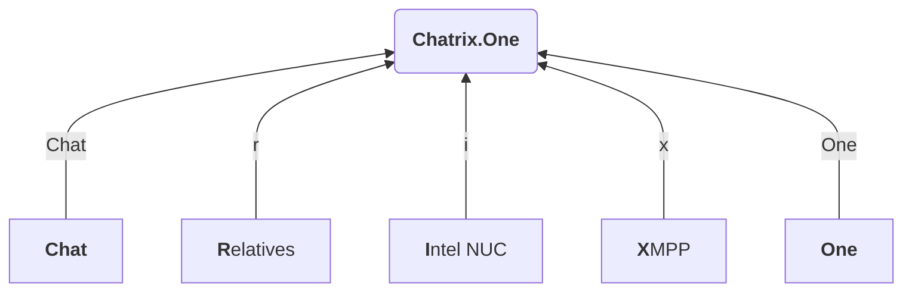

# Frequently Asked Questions

<figure markdown>
   { width="800" }
   <figcaption>Frequently asked questions when using <b>Chatrix.One</b></figcaption>
</figure>

In case of technical problems, as well as if you need help in connection with the use of **Chatrix.One**, you can send an inquiry in the form of an email or **XMPP** message to an administrator. Please first check if your question has not already been answered in the lines below. Thanks!

!!! info "Information"

     To work with the built-in search engine :fontawesome-solid-magnifying-glass:, you can use the following hotkeys:

     * ++slash++ ++f++ ++s++ - enable search mode
     * <kbd>↓</kbd> <kbd>↑</kbd> - next, previous result
     * ++enter++ - select result
     * ++esc++ - disables search mode

## Would you describe the service?

**Chatrix.One** is a Bulgarian server offering free communication based on the **XMPP**. You can send messages, emoticons, photos, voice and video messages, location and files. Voice and video connection are also available.

* * *

## What is **XMPP**?

!!! info "Information"

     **XMPP** - **Ex**tensible **M**essaging and **P**resence **P**rotocol

The easiest way to explain the principle and advantages of the **XMPP**, is to compare it to email. If you want to create your own email address, it is enough to choose a provider (server) and register a profile (account). For example, in *yahoo.com*, *gmail.com*, *hotmail.com* or another. The name of your chosen profile together with the address of the provider connected by the symbol :fontawesome-solid-at: forms your email address. For example *james@yahoo.com*. From now on, you can now exchange emails with users registered on different servers without a problem. A user of *yahoo.com* can write an email to a user of *gmail.com* or any other provider. This is possible because providers exchange messages with each other without the user being involved in any way. The advantages are obvious. Users are free to choose their provider and yet anyone can communicate with anyone. Sending messages requires nothing more than an email account with any provider and a recipient address. **XMPP** also works on a similar principle. You choose a server and get the freedom to communicate with users from other servers. In addition to being able to create multiple accounts with one provider, it is also possible to create multiple accounts with different providers. Whether it makes sense is another matter. It is possible for the **XMPP** service to be limited only within an organization's internal network. Direct access via the Internet to such a server is not possible. Communication takes place only between employees and if they are connected to the internal network, either directly or via [VPN](https://en.wikipedia.org/wiki/Virtual_private_network).

The diagram below shows the working principle of **XMPP** communication.

!!! quote ""

     **Fig.1** Model of **XMPP** communication.

     - Communication in a local network is isolated from the servers with public access in the Internet space; 
     - Client-server communication (**c2s**) takes place on port 5222; 
     - Server-server communication (**s2s**) takes place on port 5269; 
     - Subscribers can have more than one profile, both with one and with several **XMPP** providers.

A list of free **XMPP** servers can be found on the pages of [**XMPP Compliance Tester**](https://compliance.conversations.im/) and [**Jabber.at**](https://list.jabber.at/).

More information about the **XMPP** protocol is available in the article [**XMPP** - Communicate freely!](https://blog.chatrix.one/posts/XMPP-communication/)[^1] as well as in [**Wikipedia**](https://en.wikipedia.org/wiki/XMPP).

[^1]: The article is only available in Bulgarian language.

### Terminology

| Term                            | Meaning                                                |
|---------------------------------|--------------------------------------------------------|
| MUC, Room, Chatroom, Conference | Group chat, Channel or Multi-user Chat                 |
| Occupant                        | Participant                                            |
| JID                             | Address or XMPP address                                |
| Roster                          | Contact list                                           |
| Avatar                          | Profile picture                                        |

* * *

## How long has **XMPP** been around?

The protocol was born in 1998, but it actually started functioning as a platform in 1999. The history is available on the official page of [XMPP](https://xmpp.org/about/history/).

* * *

## Who uses **XMPP**?

The protocol appeared in the world back in 1999. For a quarter of a century of history, it can safely be said that it has stood the test of time. Today, **XMPP** is used by a large number of corporations, which is due to its stability and reliability.
More prominent organizations using **XMPP** on a daily basis are:

| Organization | Daily Active Users | Messages per second | Messages Daily |
|:----------------------------:|:---------------- ----------:|:-------------------:|:-------------- --:|
| :fontawesome-brands-google: Google | ~ 2,000,000,000 | - | - |
| :fontawesome-brands-apple: Apple | ~ 500,000,000 | - | - |
| :fontawesome-brands-whatsapp: WhatsApp | ~ 2,000,000,000 | - | ~ 100,000,000,000 |
| Nintendo | ~ 34,000,000 | ~ 600 | ~ 2,000,000,000 |
| League Of Legends | ~ 27,000,000 | ~ 11,000 | - |
| FORTNITE | ~ 300,000,000 | ~ 400,000 | - |
| ZOOM | ~ 200,000,000 | - | - |
| :fontawesome-brands-github: GitHub | - | - | - |
| :fontawesome-brands-facebook: Facebook | - | - | - |
| GMX | - | - | - |
| Orange | - | - | - |

For more details, see [RST Software](https://www.rst.software/blog/22-companies-using-xmpp-and-ejabberd-to-build-instant-messaging-services) page.

* * *

## What is **OMEMO**?

**OMEMO** is a method of double encryption of end-to-end communication. Encryption keys are automatically generated for each message, making communication even more secure. In other words, even if one message is compromised, the rest of the communication remains unaffected. Additional information about the method can be found on [Wikipedia](https://en.wikipedia.org/wiki/OMEMO) and on the **Conversations** website under the [OMEMO]( https://conversations.im/omemo/). The audit results of the protocol, by [**Radically Open Security BV**](https://www.radicallyopensecurity.com/), is available on the page of [**Conversations.im**](https://conversations.im/omemo/audit.pdf).

* * *

## How can I register an account?

Full information about registering a **Chatrix.One** account is available in the [Registration](https://docs.chatrix.one/en/account/registration/) section.

* * *

## Is there a registration email template posted?

A sample registration email template is available in the [Registration](https://docs.chatrix.one/en/account/registration/#example-templates-when-registering-an-account) tab.

* * *

## Is there a **XMPP** registration message template published?

A sample **XMPP** registration message template is available in the [Registration](https://docs.chatrix.one/en/account/registration/#example-templates-when-registering-an-account) tab.

* * *

## Which client do you recommend?

I use **Gajim** under **Windows** and **Linux**. For **Android** I use **Conversations** - paid version. Both clients are 100% **OMEMO** compatible and open source. I can't comment on **iOS** as I've never had a device running this operating system.

* * *

## Why choose a paid version when there is a free one?

Personally, I have chosen the paid version of **Conversations** because in this way I support the developer of the application [Daniel Gultsch](https://gultsch.de/) who contributed a lot to the development of **XMPP** in recent years. He is also credited with implementing **OMEMO** as a standard in **XMPP** communication. Ultimately, the choice is entirely yours.

* * *

## Where can I download a client for my operating system?

Detailed information about the clients available for working with **Chatrix.One** depending on the operating system you use, can be found in the section [Clients](https://docs.chatrix.one/en/clients/). For your convenience, the download links are also posted in the lines below.

=== ":fontawesome-brands-windows: Windows"

     | Client |Free | Open Source | Link |
     |:---------|:------------------:|:------------------:|:-------------------------------------------:|
     |**Gajim** | :fontawesome-solid-check: | :fontawesome-solid-check: | [Gajim.org](https://gajim.org/download) |

=== ":fontawesome-brands-linux: Linux"

     | Client | Free | Open Source | Link |
     |:---------|:------------------:|:------------------:|:---------------------------------------------------------: |
     |**Gajim** | :fontawesome-solid-check: | :fontawesome-solid-check: | [Gajim.org](https://gajim.org/download) |
     |**Dino** | :fontawesome-solid-check: | :fontawesome-solid-check: | [Dino.im](https://dino.im/#download) |

=== ":fontawesome-brands-apple: macOS"

     | Client | Free | Open Source | Link |
     |:---------|:------------------:|:------------------:|------------------------------------------------ ---------------------------:|
     |**Gajim** | :fontawesome-solid-check: | :fontawesome-solid-check: | [Gajim.org](https://dev.gajim.org/gajim/gajim/-/wikis/help/Gajim-on-macOS) |
     |**Beagle IM** | :fontawesome-solid-check: | :fontawesome-solid-check: | [Mac App Store](https://apps.apple.com/us/app/beagleim-by-tigase-inc/id1445349494) |

=== ":fontawesome-brands-google-play: Android"

     | Client | Free | Open Source | Link |
     |:-----------------|:------------------:|:------------------:|:-------------------------------------- ------------------------------:|
     |**Conversations** | :fontawesome-solid-check: | :fontawesome-solid-check: | [F-droid](https://f-droid.org/packages/eu.siacs.conversations/) |
     |**Conversations** | **7.79 BGN** | :fontawesome-solid-check: | [Google Play](https://play.google.com/store/apps/details?id=eu.siacs.conversations) |

=== ":fontawesome-brands-apple: iOS"

     | Client | Free | Open Source | Link |
     |:---------|:------------------:|:------------------:|:------------------------------------------------ -----------------------------:|
     |**Monal** | :fontawesome-solid-check: | :fontawesome-solid-check: | [App Store](https://apps.apple.com/us/app/monal-xmpp-chat/id317711500) |

=== ":fontawesome-brands-firefox: Web"

     | Client | Free | Open Source | Link |
     |:--------------|:------------------:|:------------------:|:---------------------------------------- ---------------------:|
     |**Converse.js** | :fontawesome-solid-check: | :fontawesome-solid-check: | [Conversejs.org](https://conversejs.org/fullscreen.html) |

=== ":fontawesome-solid-terminal: CLI"

     | Client | Free | Open Source | Link |
     |:-------------|:------------------:|:------------------:|:-------------------------------------------------- ----------:|
     |**Profanity** | :fontawesome-solid-check: | :fontawesome-solid-check: | [Profanity-IM](https://profanity-im.github.io/) |

* * *

## Can I have multiple accounts registered on different servers?

You can have as many accounts as you want, both on one and on different servers. It is even possible to control them from the same device. You will only have to log in with each individual account separately in the settings of the software you are using. Please note that registration of more than one account per user in **Chatrix.One**is not allowed. For more information, please read the rules in the [Terms](https://docs.chatrix.one/en/terms/#they-are-forbidden) section.

* * *

## Which clients support **OMEMO**?

Customers with 100% OMEMO compatibility:

- **Conversations**;
- **Converse.js**;
- **Dino**;
- **Gajim**;
- **Monal**;
- **Chat Secure**;
- **Profanity**.

The ones listed above have been tested with the exception of **Monal** and **Chat Secure**. A detailed list of clients and their compatibility is available at [Are We OMEMO Yet?](https://omemo.top/).

* * *

## How do I know if I'm using  **OMEMO**?

If messages in **Conversations** are accompanied by *"shield with a checkmark"* indicator :material-shield-check: this is a sure sign that you are using **OMEMO**. In **Gajim**, check for a green colored *"shield"* symbol :material-shield: next to the date and time of the messages. It will be fully colored when you have trusted the device. In case you have not added the device to the list of trusted devices, the "shield" symbol will be half colored green. The situation is similar for all other applications.

!!! warning "Caution"

     In case the messages are not encrypted in **Conversations** they will be written on a red background. In **Gajim** you will see an unlocked padlock with an orange `!` symbol on it. It is located to the right of the ribbon in which you are typing.

* * *

## Can I use another encryption method?

You can also use **OpenPGP**, but I recommend that you familiarize yourself with the possible security issues of this method first. For more information see the module page - [XEP-0027: Current Jabber OpenPGP Usage](https://xmpp.org/extensions/xep-0027.html) and specifically the [Security Considerations](https://xmpp.org/extensions/xep-0027.html#security).

* * *

## Can I use **OTR** encryption?

Support for the **OTR** encryption method has been discontinued due to its vulnerability to [Man-In-The-Middle](https://en.wikipedia.org/wiki/Man-in- the-middle_attack). For more information see the module page - [XEP-0364: Current Off-the-Record Messaging Usage](https://xmpp.org/extensions/xep-0364.html) and specifically the part [Security Considerations](https://xmpp.org/extensions/xep-0364.html#security).

* * *

## Is the voice communication encrypted?

In case you have enabled an encryption method (**OMEMO** or **OpenPGP**) the audio communication will also be encrypted. In the **Conversations** app, this will be marked with green *"shield with a checkmark"* :material-shield-check: symbol in the upper left corner of the screen.

* * *

## Is the video communication encrypted?

In case you have enabled an encryption method (**OMEMO** or **OpenPGP**) the video communication will also be encrypted. In the **Conversations** app, this will be marked with green *"shield with a checkmark"* :material-shield-check: symbol in the upper left corner of the screen.

* * *

## How to recover a forgotten password?

If I don't know you personally, you will have to remember it. Otherwise, register a new account. The password is the only way to verify that you are the owner of the account.

!!! tip "Tip"

      Next time, use password management software (**Password Manager**). I would recommend [Bitwarden](https://bitwarden.com/).

* * *

## How do I change the password?

Check in the profile settings section of the app you are using. For example:

- **Gajim**

`Avatar Picture` → `General` → `Login` → `Change Password`

- **Conversations**

`Home screen` → `Menu with three dots` → `Manage accounts` → `Select account` → `Three dots` → `Change password`

For other customers, the procedure is similar.

You can also change your password using the online password change form [here](https://docs.chatrix.one/en/account/change-password/).

* * *

## Is two-factor authentication supported?

[Second Factor Authentication](https://en.wikipedia.org/wiki/Multi-factor_authentication), also known as **Multi Factor Authentication** (**2FA**, **MFA**), is currently not integrated into the **XMPP** service offered by **Chatrix.One**. Authentication is done with username and password only. It is for this reason that I advise you to be judicious in choosing a password. Advice on choosing a password can be found in the [Registration](https://docs.chatrix.one/en/account/registration/) section.

* * *

## Can I delete a profile?

Yes. The steps are similar to changing your password. In the account setup section, you have an option to delete it. For mobile apps, tap and hold on the profile itself. You will see a delete option.
You can also delete your account using the online form [here](https://docs.chatrix.one/en/account/delete-account/).

!!! warning "Warning"

     Not all applications delete the profile from the server! For some, like **Conversations**, the profile is only removed from the app, but remains on the server. I advise you to check the instructions of the software itself.

* * *

## Are there any rules I need to follow?

Of course. There are rules and they are mandatory for everyone. Please familiarize yourself with them in the [Terms](https://docs.chatrix.one/en/terms/) section.

* * *

## Do I have to write only in Cyrillic?

You can write in any language you want, as long as you follow the [Terms](https://docs.chatrix.one/en/terms/) for using the service.

* * *

## On how many devices can I use the service?

You have virtually no limits. Just keep in mind that adding each new device leads to a loss of trust in your correspondents. In other words, they will have to trust you again, either by "blind trust" or by scanning a [QR](https://en.wikipedia.org/wiki/QR_code) code from the screen of one of your active devices.

* * *

## What does **Blind Trust** mean?

In short, it's a way to trust a device owned by the person you're communicating with, without being 100% sure that it's really them on the other end. The most secure way to trust is by scanning the **QR** code from the screen of a device owned by your correspondent. It is enough to scan only one of the devices. You'll notice that the more devices you own, the more complex the **QR** code becomes. This is because it contains the IDs of all the devices on your account. Detailed information can be found in the publication [Blind Trust Before Verification](https://gultsch.de/trust.html) by **Daniel Gultsch**.

* * *

## Will I know if the other side got the message?

Yes, if the user is among your trusted contacts. A :material-check: symbol will appear below the message.
In the newer versions of the client software, the following indications are available:

- :material-check: - The message was successfully sent by the sender's server
- :material-check-all: - The message was successfully received by the recipient's server or **MUC**
- :material-check-all:{ .received} - The message was successfully received by the recipient

* * *

## Will I be able to correct wrongly sent messages?

Yes, you will be able to correct the last message sent, which will be reflected by the appearance of a :material-pencil: symbol next to the date and time of the relevant message.

* * *

## Will I see if the other party is writing to me right now?

Yes. You will see a message like *"John is typing..."*. Accordingly, there is also a message if writing is suspended.

* * *

## Can I block notification of whether I'm writing or not?

Yes. Look in the application settings, section **Privacy**.

* * *

## Will others know if I'm online?

Yes. Check if you have enabled this option. This is usually done from your app settings, **Privacy** section.

* * *

## If I upload the wrong file or image, can I delete them?

You can, but only from your device. From the server and devices of other users, this is impossible.

* * *

## Can I create rooms?

Yes. You can create rooms and invite friends to a shared chat.

* * *

## Can I create a **Shared Rooster Group**?

No, but if you contact me I can create one. This way, there will be no need to invite all the members separately. The group will be immediately visible in the application to everyone included in it. For connection, it is best to send an **XMPP** message to an administrator.

* * *

## Why am I not receiving notifications on my mobile device?

=== ":fontawesome-brands-android: Android"

    You are probably using a phone without **Google Play Services** or **Google Cloud Messaging**.

    !!! success "Solution"

        Set the app to run in the foreground.

=== ":fontawesome-brands-apple: iOS"

     - You are probably using the **ChatSecure** application and have not enabled the "**Push**" option in the settings.

    !!! success "Solution"

        Check the app settings. Also, see the operating system settings, specifically the background notification status part. If still no result try **Monal** app.

     - The battery is dead or you have activated battery saver mode.

    !!! success "Solution"

        Charge the battery and turn off the battery saver mode.

* * *

## Why do I get an error message when trying to register?

In order to protect the service from bots and abuse, the following restrictions have been introduced:

- It is possible that the registration is temporarily prohibited at the moment. Please check [status](https://docs.chatrix.one/en/status/#account-registrations). In the "Account Registration" section, it must be marked as **OPEN**;
- Only one registration per hour is allowed through the online registration form regardless of the **IP** address;
- Only one registration is allowed through the installed applications within one hour from the same **IP** address;
- With a large number of requests to generate **CAPTCHA** codes, the page blocks access for about a minute. This protects the service from a **CAPTCHA DoS** attack;
- With multiple attempts to illegally access the service, the **IP** address is blocked for six hours.

If the status of the registrations is marked as **CLOSED**, you will need to use one of the other possible methods of registering an account described in the section "Registration" and precisely the part [Ways to register an account](https://docs.chatrix.one/en/account/registration/#ways-to-register-an-account). For all other cases, the solution is to try again later.

* * *

## Why do I get an invalid **SSL/TLS** certificate message?

You are probably using a device with an outdated operating system (**Android** 6 or 7). You can manually accept the certificate.

!!! warning "Caution"

     Before manually accepting a certificate, you **must** pay attention and make sure it is registered for the following domains: `chatrix.one`, `conference.chatrix.one`, `pubsub.chatrix.one`, `proxy.chatrix .one` and `upload.chatrix.one`. Otherwise, you may become a victim of the so-called [Man-In-The-Middle](https://en.wikipedia.org/wiki/Man-in-the-middle_attack) hacking attack.

* * *

## Why can't I have audio and video communication with **Gadjim**?

You are probably using **Windows** as your operating system. Currently, **Gajim** supports audio and video communication only under **Linux**.

* * *

## How do I turn off message archiving?

If you do not want the messages to be stored for the specified period, you have the option to turn off archiving.

- **Conversations**

`Manage Accounts` → `Choose an Account` → `The Three Dots` → `Backup Options` → `Never`

- **Gajim**

`Avatar Picture` → `Privacy` → `Keep Chat History` → `Until Gajim is Closed`

For other customers, the procedure is similar.

* * *

## What data do you store on the server?

Detailed information can be found in the [Privacy](https://docs.chatrix.one/en/privacy/#view-stored-data) article.

* * *

## What data is transferred to enable **Push Notifications**?

You can read a detailed description on the **Github** application page [Conversations](https://github.com/iNPUTmice/p2/blob/master/README.md#conversations-push-proxy).

* * *

## Are the photos I upload encrypted?

Yes, but only if you have enabled end-to-end encryption, for example **OMEMO**.

* * *

## What would a photo that is stored on the server in encrypted form look like?

If it is downloaded from the server and an attempt is made to view it on a computer or other device, all you will see is a pure black screen.

* * *

## Once you have access to the server, can you decrypt users' messages and files?

Administrator access alone is not sufficient to decrypt communication and files stored on the server. The keys with which the encryption was performed are also needed, and they are stored on the users' devices. Therefore, I am unable to access the communication in readable form.

!!! info "Information"

     One of the things that I am extremely responsible for is that personal communication remains truly personal. For more information, see the [Privacy](https://docs.chatrix.one/en/privacy/) section.

* * *

## Will the service be available after "**X**" years?

This service is not currently scheduled to be discontinued. Until I run into financial difficulties or other serious reasons arise, I will offer the **XMPP** service. Termination will of course be announced in due course.

!!! info "Information"

     If you want to ensure the long-term functioning of **Chatrix.One**, you can participate in the financing. If you need more information, please contact an administrator.

* * *

## What costs does this type of service generate?

- Purchase of a domain, as well as an annual fee;
- Monthly server rent - cloud or physical;
- Internet costs - generated traffic;
- Electricity costs;
- Second server - to store backup copies of critical information;
- Hardware;
- Personal time.

* * *

## Why do you even offer such a service?

Because I have the desire, opportunity and time, but above all it gives me great pleasure and last but not least - I like to control my own data whenever possible.

* * *

## Why is the service free?

Because at the moment I can afford it.

* * *

## How secure is the service?

The current **XMPP** standards allow very secure messaging - you just have to use them! I always use the latest encryption methods on the server and block connection establishment through insecure channels. In order to reduce the scope for hackers, I have disabled **SSH** access as well as web-based server administration. The firewall is set as restrictive as possible. Communication is secured by **TLS** certificate from [ZeroSSL](https://zerossl.com/) and [Let's Encrypt](https://letsencrypt.org/). Key exchange is via [Diffie-Hellman](https://en.wikipedia.org/wiki/Diffie-Hellman).

* * *

## How stable is the service?

My observations on **XMPP** based service since 2018. to date show that the service is extremely stable. At the moment, the system has enough [RAM](https://en.wikipedia.org/wiki/Random-access_memory) memory, so that it can accommodate several thousand active users at the same time.

* * *

## Are you up to date with the latest developments 
in **XMPP**?

As soon as it is technically possible and reasonable, new **XMPP** extensions and best practices will be implemented on this server. For me, full compatibility with the flagship **Conversations** project, which has undoubtedly helped **XMPP** reach new heights in recent years, is important. **Chatrix.One** test result can be seen online [XMPP Compliance Report](https://compliance.conversations.im/server/chatrix.one/).

* * *

## What database are you using?

I am using [PostgreSQL](https://www.postgresql.org/).

* * *

## Are passwords stored in readable form?

No. Passwords are encrypted using the [SCRAM-SHA1](https://wiki.xmpp.org/web/SASL_Authentication_and_SCRAM#SCRAM-SHA-1(-PLUS)) mechanism.

* * *

## Why is it called **Chatrix.One**?

Because it's primarily a **Chat**. Originally intended to be used only among relative **R**elatives, it was hosted on an **I**ntel NUC and based on **X**MPP. The ending **One** - because it is the only method of this type of communication that I need at the moment. And last but not least, because the domain was free.

* * *

## How many people deal with the administration?

At the moment I am the only person, which has its advantages and disadvantages.

!!! warning "Caution!"

     Main Drawback: [Bus Factor](https://en.wikipedia.org/wiki/Bus_factor) = 1

* * *

## How much electricity does it use?

In order to minimize electricity consumption, I use a processor based on the **ARM** architecture. At 100% load on all four cores, consumption reaches 10.4W. Most of the time the server is under 10% load.

* * *

## Why **Ejabberd** and not **Prosody**?

There are many reasons for my decision to choose **Ejabberd**. Most of them are based on the flaws I find in **Prosody**, and they probably won't be fixed anytime soon:

- **Prosody** consumes more system memory. The situation has improved a bit with `mod_external_upload` and the new versions of the **PostgreSQL** binding code, but there is still a lot to be desired;
- **Prosody** uses only one CPU core;
- Cannot be upgraded in a cluster;
- In the future, if there is a need, I would not be able to provide a service of the **High Availability** type;
- Sometimes not keeping up with the new **XMPP** standards required by the **Conversations** app for **Android**;
- For voice and video connection requires installation of additional [STUN](https://en.wikipedia.org/wiki/STUN)/[TURN](https://en.wikipedia.org/wiki/Traversal_Using_Relays_around_NAT) server.

**Ejabberd** has some advantages over **Prosody**:

- Developers have many years of experience with **XMPP** - **Ejabberd** is a very mature platform;
- The [Erlang](https://en.wikipedia.org/wiki/Erlang_(programming_language)) language, in which **Ejabberd** is written, was created exactly for this kind of applications and is known for its high performance;
- **Ejabberd** uses all available CPU cores;
- Can be integrated into a cluster;
- It has been used for many years by large [corporations](https://www.rst.software/blog/22-companies-using-xmpp-and-ejabberd-to-build-instant-messaging-services), which confirms its stability;
- Supported by the company [ProcessOne](https://www.process-one.net/) which has a clear funding mechanism;
- **Conversation.im** uses **Ejabberd** and in development the vendor refers to it instead of **Prosody**.

Do not get me wrong. I still see in **Prosody** a wonderful opportunity to create an **XMPP** server. I even still maintain and use one. It is an indisputable fact that it is extremely easy to work with.

* * *

## Do you offer other free services?

At the moment, the following services are functioning on this domain:

- [x] **XMPP**
- [ ] **DNS**
- [ ] **Email**
- [ ] **Matrix** server
- [ ] **Nextcloud**

!!! info "Information"

     Only **XMPP** is a publicly available service. The rest are currently in the experimental phase. If any of them do become publicly accessible, this will be announced on the web page. You will also notice the change in color of the :fontawesome-regular-circle-check: symbol in front of the corresponding service from gray to green.

!!! tip "Tip"

     Please do not send emails or messages inquiring about dates and deadlines for public access to services other than **XMPP**. Inquiries of this nature **will not** be answered.

## Are you planning to have a a free **Matrix** server with public access?

Currently [Matrix](https://en.wikipedia.org/wiki/Matrix_(protocol)) is functional but not publicly accessible. The maintenance of this platform is much more complex and time-consuming, and therefore costs more personal time. It also requires more hardware and financial resources. In any case, I will need at least one more volunteer, experienced in **Linux** system administration, willing to invest **for free** some of their free time in the name of the cause.

* * *

## Are you planning to have a free, publicly accessible email service?

Email is currently functional but not publicly accessible. The maintenance of this type of service is associated with a significantly greater responsibility to the end user. Of utmost importance is the round-the-clock monitoring of the system in order to prevent security-related incidents. It is complex to integrate, but maintenance is even more complex and time-consuming, and therefore costs much more personal time. It requires a large hardware and financial resource. In any case, I will need at least one or two more volunteers, experienced in **Linux** system administration, willing to invest **for free** some of their free time in the name of the cause.

* * *

## Are you planning to have a free publicly accessible file storage cloud?

Currently, cloud file storage is operational, but not publicly accessible. The maintenance of this type of service is related to the provision of an array to store a significant amount of data. Responsibility to the end user is a serious part of this business. Of utmost importance is the round-the-clock monitoring of the system in order to prevent security-related incidents. Maintenance is labor-intensive, and therefore costs much more personal time. It requires a serious investment in hardware. In any case, I will need at least one or two more volunteers, experienced in **Linux** system administration, willing to invest **for free** some of their free time in the name of the cause.

* * *

## Are there terms and conditions for using the service?

The rules for using the service are published in the [Terms](https://docs.chatrix.one/en/terms/) section.

* * *

## Can I report a violation of the terms of service?

See the [Terms](https://docs.chatrix.one/en/terms/) section and specifically the [Reporting a violation](https://docs.chatrix.one/en/terms/#reporting-a-violation) section.

* * *

## Will you know if the service becomes unavailable?

The service is monitored around the clock on many different indicators. Besides, I personally use it daily. In case of a problem I will be known within seconds. Therefore, you should not have to contact me to let me know that something is wrong. I will make sure that the problem is fixed as soon as possible.

!!! info "Information"

     I take **continuity of service** extremely seriously, but keep in mind that I have a family and personal commitments. Therefore, sending a bunch of messages or emails asking questions like: *When are you going to fix the problem?* won't do me any good.

* * *

## Is the service available outside Bulgaria?

You can use **Chatrix.One** from anywhere in the world. There are currently no [GeoIP](https://en.wikipedia.org/wiki/Geo-blocking) traffic blocking rules applied.

* * *

## Where can I track incidents?

Information about incidents, service interruptions and upcoming preventive maintenance will be published in the [Status](https://docs.chatrix.one/en/status/#information-about-occurred-incidents) section.

* * *

## Is technical information available for the service?

Check in the [Status](https://docs.chatrix.one/en/status/#technical-data) section.

* * *

## How can I contact you?

Contacts are available at the bottom of the page, as well as in the [About](https://docs.chatrix.one/en/about/#contacts) tab. If you are using a mobile device please check the :material-menu: menu.
