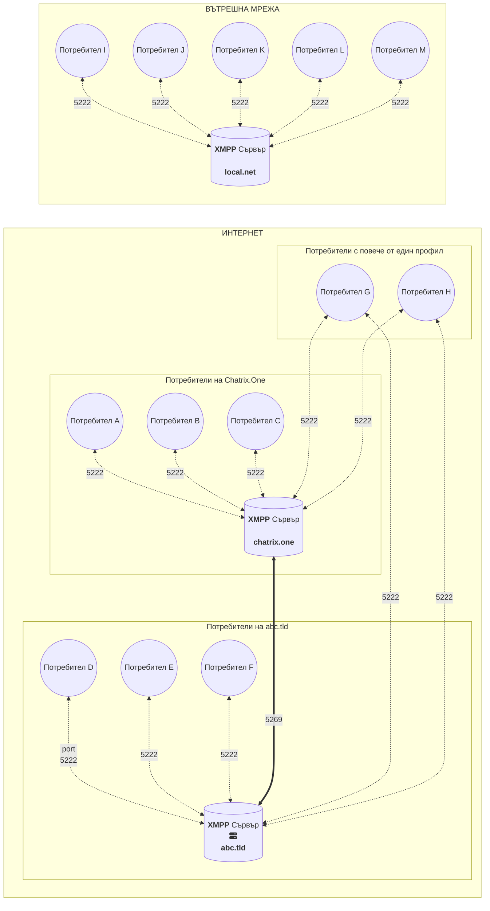
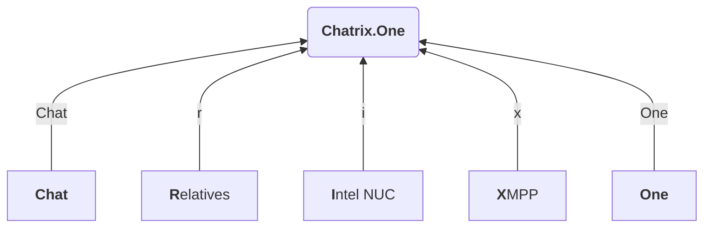

# Често Задавани Въпроси

<figure markdown>
  { width="800" }
  <figcaption>Често задавани въпроси при използване на <b>Chatrix.One</b></figcaption>
</figure>

При наличие на технически проблеми, както и при нужда от помощ във връзка с използването на **Chatrix.One**, можете да изпратите запитване под формата на имейл или **XMPP** съобщение до администратор. Моля, преди това да проверите дали вече не е отговорено на Вашия въпрос в редовете по-долу. Благодаря!

!!! info "Информация"

    За работа с търсачката :fontawesome-solid-magnifying-glass: можете да използвате следните бързи клавиши:

    * ++slash++ ++f++ ++s++ - активират режим търсене
    * <kbd>↓</kbd> <kbd>↑</kbd> - следващ, предишен резултат
    * ++enter++ - избор на резултат
    * ++esc++ - деактивира режим търсене

## Какво представлява услугата?

**Chatrix.One** е сървър предлагащ комуникация, базирана на **XMPP** протокол. Можете да изпращате съобщения, емотикони, снимки, гласови и видео съобщения, местоположение и файлове. На разположение са още гласова и видео връзка.

* * *

## Какво представлява **XMPP**?

!!! info "Информация"

    **XMPP** - **Ex**tensible **M**essaging and **P**resence **P**rotocol

Най-лесният начин да обясня принципа и предимствата на **XMPP**, е да го сравня с електронната поща. Ако искате да си създадете Ваш собствен имейл адрес, достатъчно е да изберете доставчик (сървър) и да регистрирате профил (акаунт). Например в *abv.bg*, *gmail.com*, *mail.bg* или друг. Името на избрания от Вас профил заедно с адреса на доставчика, свързани посредством символа :fontawesome-solid-at:, образуват Вашия имейл адрес. Например *pesho@dostavchik.com*. От този момент, вече можете да обменяте имейли с потребители регистрирани на различни сървъри без проблем. Потребител на *abv.bg*, може да напише имейл до потребител на *gmail.com* или който и да било друг доставчик. Това е възможно, тъй като доставчиците обменят съобщения помежду си, без потребителят да е ангажиран по някакъв начин с това. Предимствата са очевидни. Потребителите могат свободно да избират своя доставчик и все пак всеки може да общува с всеки. За изпращането на съобщения не се изисква нищо друго освен профил за електронна поща, при който и да е доставчик и адрес на получателя. На подобен принцип работи и **XMPP**. Избирате сървър и получавате свобода да комуникирате с потребители от други сървъри. Освен, че можете да създавате няколко профила при един доставчик, е възможно да създавате и множество профили при различни доставчици. Дали има смисъл от това е друг въпрос. Възможно е **XMPP** услугата да бъде ограничена само в рамките на вътрешната мрежа на дадена организация. Директен достъп през Интернет до такъв сървър не е възможен. Комуникацията се извършва само сред служителите и то ако са свързани към вътрешната мрежа, директно или чрез [**VPN**](https://en.wikipedia.org/wiki/Virtual_private_network).

На графиката по-долу е представен принципът на на работа на **XMPP** комуникацията.

!!! quote ""

    **Фиг.1** Модел на **XMPP** комуникация.

    - Комуникацията в локална мрежа е изолирана от сървърите с публичен достъп в Интернет пространството; 
    - Комуникацията клиент-сървър (**c2s**) се осъществява на порт 5222; 
    - Комуникацията сървър-сървър (**s2s**) се осъществява на порт 5269; 
    - Абонатите могат да притежават повече от един профил, както при един, така и при няколко **XMPP** доставчика.

### Терминология

| Термин                              | Значение                                               |
|-------------------------------------|--------------------------------------------------------|
| **MUC, Room, Chatroom, Conference** | Групов чат, стая, конференция, чат с много потребители |
| **Occupant**                        | Участник                                               |
| **JID**                             | Адрес или XMPP адрес                                   |
| **Roster**                          | Списък с контакти                                      |
| **Avatar**                          | Профилна снимка                                        |

### Допълнителна информация относно **XMPP**

- [**XMPP** - Комуникирай свободно!](https://blog.chatrix.one/posts/XMPP-communication/)
- [**XMPP Providers**](https://providers.xmpp.net/about/)
- [**Wikipedia**](https://bg.wikipedia.org/wiki/Extensible_Messaging_and_Presence_Protocol)

### Списъци с безплатни **XMPP** сървъри

- [**XMPP Compliance Tester**](https://compliance.conversations.im/)
- [**Jabber.at**](https://list.jabber.at/)
- [**XMPP Providers**](https://providers.xmpp.net/#category-a)

* * *

## От колко време съществува XMPP?

Протоколът се заражда през 1998г., но реално като платформа започва да функционира през 1999г. Хронологията е достъпна на официалната страница на [**XMPP**](https://xmpp.org/about/history/).

* * *

## Кой използва **XMPP**?

Протоколът се появява на бял свят още през далечната 1999г. За четвърт век история може спокойно да се каже, че е издържал теста на времето. Днес **XMPP** се използва от голям брой корпорации, което е породено от неговата стабилност и надеждност.
По-известни организациите използващи ежедневно **XMPP** са:

| Организация                   | Активни потребители дневно | Съобщения в секунда | Съобщения дневно  |
|:-----------------------------:|:--------------------------:|:-------------------:|:-----------------:|
| :fontawesome-brands-google: Google | ~ 2 000 000 000       |  -                  | -                 |
| :fontawesome-brands-apple: Apple   | ~ 500 000 000         |  -                  | -                 |
| :fontawesome-brands-whatsapp: WhatsApp | ~ 2 000 000 000   |  -                  | ~ 100 000 000 000 |
| Nintendo                      | ~ 34 000 000               |  ~ 600              | ~ 2 000 000 000   |
| League Of Legends             | ~ 27 000 000               |  ~ 11 000           | -                 |
| FORTNITE                      | ~ 300 000 000              |  ~ 400 000          | -                 |
| ZOOM                          | ~ 200 000 000              |  -                  | -                 |
| :fontawesome-brands-github: GitHub | -                     |  -                  | -                 |
| :fontawesome-brands-facebook: Facebook | -                 |  -                  | -                 |
| GMX                           | -                          |  -                  | -                 |
| Orange                        | -                          |  -                  | -                 |

За повече детайли вижте страницата на [**RST Software**](https://www.rst.software/blog/22-companies-using-xmpp-and-ejabberd-to-build-instant-messaging-services).

* * *

## Какво представлява **OMEMO**?

**OMEMO** представлява метод за двойно криптиране на комуникацията от край до край. Ключовете за криптиране автоматично се генерират за всяко едно съобщение, което прави комуникацията още по-сигурна. Иначе казано, дори да бъде компрометирано едно съобщение, останалата комуникация остава незасегната. Допълнителна информация за метода можете да намерите в [**Wikipedia**](https://en.wikipedia.org/wiki/OMEMO) и на интернет страницата на **Conversations** в раздела [**OMEMO**](https://conversations.im/omemo/). Резултатите от проведения одит на протокола, от [**Radically Open Security BV**](https://www.radicallyopensecurity.com/), е наличен на страницата на [**Conversations.im**](https://conversations.im/omemo/audit.pdf).

* * *

## Как мога да регистрирам профил?

Пълна информация относно регистрирането на профил в **Chatrix.One** е налична в раздела [Регистрация](https://docs.chatrix.one/account/registration/).

* * *

## Има ли публикуван шаблон на имейл за регистрация?

Шаблон на примерен имейл за регистрация е наличен в раздела [Регистрация](https://docs.chatrix.one/account/registration/#__tabbed_1_1).

* * *

## Има ли публикуван шаблон на **XMPP** съобщение за регистрация?

Шаблон на примерно **XMPP** съобщение за регистрация е налично в раздела [Регистрация](https://docs.chatrix.one/account/registration/#__tabbed_1_2).

* * *

## Кой клиент препоръчвате?

Използвам **Gajim** под **Windows** и **Linux**. За **Android** използвам **Conversations** - платена версия. И двата клиента са със 100% **OMEMO** съвместимост и са с отворен код. За **iOS** не мога да дам мнение, тъй като никога не съм разполагал с устройство работещо под тази операционна система.

* * *

## Защо да избирам платена версия, след като има безплатна?

Аз лично, съм избрал платената версия на **Conversations**, защото по този начин подпомагам разработчика на приложението [**Daniel Gultsch**](https://gultsch.de/), който допринесе изключително много за развитието на **XMPP** през последните години. Също негова е заслугата за внедряването на **OMEMO**, като стандарт в **XMPP** комуникацията. В крайна сметка изборът е изцяло Ваш.

* * *

## От къде мога да сваля клиент за моята операционна система?

Подробна информация относно наличните клиенти за работа с **Chatrix.One**, в зависимост от операционната система която използвате, можете да намерите в раздел [Клиенти](https://docs.chatrix.one/clients/). За Ваше удобство връзките за сваляне са публикувани и в редовете по-долу.

=== ":fontawesome-brands-windows: Windows"

    | Клиент   |Безплатен           |  Отворен код       | Линк                                        |
    |:---------|:------------------:|:------------------:|:-------------------------------------------:|
    |**Gajim** | :fontawesome-solid-check: | :fontawesome-solid-check: | [**Gajim.org**](https://gajim.org/download) |

=== ":fontawesome-brands-linux: Linux"

    | Клиент   | Безплатен          |  Отворен код       | Линк                                         |
    |:---------|:------------------:|:------------------:|:--------------------------------------------:|
    |**Gajim** | :fontawesome-solid-check: |  :fontawesome-solid-check: | [**Gajim.org**](https://gajim.org/download) |
    |**Dino**  | :fontawesome-solid-check: |  :fontawesome-solid-check: | [**Dino.im**](https://dino.im/#download)    |

=== ":fontawesome-brands-apple: macOS"

    | Клиент   | Безплатен          |  Отворен код       | Линк                                                                     |
    |:---------|:------------------:|:------------------:|-------------------------------------------------------------------------:|
    |**Gajim** | :fontawesome-solid-check: | :fontawesome-solid-check: | [**Gajim.org**](https://dev.gajim.org/gajim/gajim/-/wikis/help/Gajim-on-macOS) |
    |**Beagle IM** | :fontawesome-solid-check: | :fontawesome-solid-check: | [**Mac App Store**](https://apps.apple.com/us/app/beagleim-by-tigase-inc/id1445349494) |

=== ":fontawesome-brands-google-play: Android"

    | Клиент           | Безплатен          |  Отворен код       | Линк                                                                |
    |:-----------------|:------------------:|:------------------:|:-------------------------------------------------------------------:|
    |**Conversations** | :fontawesome-solid-check: | :fontawesome-solid-check: | [**F-droid**](https://f-droid.org/packages/eu.siacs.conversations/) |
    |**Conversations** | **9.79лв**         | :fontawesome-solid-check: | [**Google Play**](https://play.google.com/store/apps/details?id=eu.siacs.conversations) |

=== ":fontawesome-brands-apple: iOS"

    | Клиент   | Безплатен          |  Отворен код       | Линк                                                                       |
    |:---------|:------------------:|:------------------:|:--------------------------------------------------------------------------:|
    |**Monal** | :fontawesome-solid-check: | :fontawesome-solid-check: | [**App Store**](https://apps.apple.com/us/app/monal-xmpp-chat/id317711500) |

=== ":fontawesome-brands-firefox: Web"

    | Клиент         | Безплатен          |  Отворен код       | Линк                                                         |
    |:---------------|:------------------:|:------------------:|:------------------------------------------------------------:|
    |**Converse.js** | :fontawesome-solid-check: | :fontawesome-solid-check: | [**Conversejs.org**](https://conversejs.org/fullscreen.html) |

=== ":fontawesome-solid-terminal: CLI"

    | Клиент       | Безплатен          |  Отворен код       | Линк                                                |
    |:-------------|:------------------:|:------------------:|:---------------------------------------------------:|
    |**Profanity** | :fontawesome-solid-check: | :fontawesome-solid-check: | [**Profanity-IM**](https://profanity-im.github.io/) |

* * *

## Мога ли да имам няколко профила, регистрирани на различни сървъри?

Можете да имате колкото профила пожелаете, както на един, така и на на различни сървъри. Възможно е дори да ги управлявате от едно и също устройство. Единствено ще трябва да се впишете с всеки отделен профил поотделно в настройките на софтуера, който използвате. Имайте предвид, че регистрацията на повече от един профил за един потребител на **Chatrix.One** не е позволена. За повече информация, моля да се запознаете с правилата в раздел [Условия](https://docs.chatrix.one/terms/#%D0%B7%D0%B0%D0%B1%D1%80%D0%B0%D0%BD%D0%B5%D0%BD%D0%B8-%D1%81%D0%B0).

* * *

## Кои клиенти поддържат **OMEMO**?

Клиенти със 100% OMEMO съвместимост:

- **Conversations**;
- **Converse.js**;
- **Dino**;
- **Gajim**;
- **Monal**;
- **Chat Secure**;
- **Profanity**.

Изброените по-горе са тествани с изключение на **Monal** и **Chat Secure**. Подробен списък с клиенти и тяхната съвместимост е наличен на сайта [**Are We OMEMO Yet?**](https://omemo.top/).

* * *

## Как мога да разбера дали използвам **OMEMO**?

Ако съобщенията  в **Conversations** са придружени с индикатор *щит с отметка* :material-shield-check:, това е сигурен знак, че комуникацията е **OMEMO** шифрована.

В случай, че използвате **Gajim**, възможните сценарии са два:

- :material-shield-half-full:{ .green} - Зелено оцветен символ *щит* до датата и часа на съобщенията, който е наполовина оцветен. Означава, че комуникацията е **OMEMO** криптирана, но устройството с което комуникирате не е проверено. Иначе казано, направили сте, така нареченото *сляпо доверяване*;
- :material-shield:{ .green} - Зелено оцветен символ *щит* до датата и часа на съобщенията, който е изцяло оцветен. Означава, че комуникацията е **OMEMO** криптирана и устройството с което комуникирате, е проверено и е добавено в списъка с доверени устройства.

За всички останалите приложения ситуацията е аналогична.

!!! warning "Внимание"

    В случай, че съобщенията **не** са криптирани в **Conversations** ще бъдат изписани на червен фон. В **Gajim** ще виждате отключен катинар с оранжев символ `!` върху него. Намира се отдясно на лентата в която пишете.

* * *

## Мога ли да използвам друг метод на криптиране?

Можете да използвате и **OpenPGP**, но Ви препоръчвам преди това да се запознаете с възможните проблеми със сигурността на този метод. За повече информация вижте страницата на модула - [**XEP-0027: Current Jabber OpenPGP Usage**](https://xmpp.org/extensions/xep-0027.html) и по-точно частта [**Security Considerations**](https://xmpp.org/extensions/xep-0027.html#security).

* * *

## Мога ли да използвам **OTR** криптиране?

Поддръжката, на **OTR** метода за криптиране, е преустановена. Причината е, неговата уязвимост към атаки от типа [**Man-In-The-Middle**](https://en.wikipedia.org/wiki/Man-in-the-middle_attack). За повече информация вижте страницата на модула - [**XEP-0364: Current Off-the-Record Messaging Usage**](https://xmpp.org/extensions/xep-0364.html) и по-точно частта [**Security Considerations**](https://xmpp.org/extensions/xep-0364.html#security).

* * *

## Криптирана ли е гласовата комуникация?

В случай, че сте активирали метод на криптиране (**OMEMO** или **OpenPGP**) аудио комуникацията също ще бъде криптирана. В приложението **Conversations** това ще бъде отбелязано със зелено оцветен символ *щит с отметка* :material-shield-check:{ .green} в горния ляв ъгъл на екрана.

* * *

## Криптирана ли е видео комуникацията?

В случай, че сте активирали метод на криптиране (**OMEMO** или **OpenPGP**) видео комуникацията също ще бъде криптирана. В приложението **Conversations** това ще бъде отбелязано със зелено оцветен символ *щит с отметка* :material-shield-check:{ .green} в горния ляв ъгъл на екрана.

* * *

## Как да възстановя забравена парола?

Ако не Ви познавам лично, ще се наложи да си я спомните. В противен случай, регистрирайте нов профил. Паролата е единственият начин да удостоверите, че точно Вие сте собственикът на профила.

!!! tip "Съвет"

     Следващият път използвайте софтуер за управление на пароли (**Password Manager**). Бих препоръчал [**Bitwarden**](https://bitwarden.com/).

* * *

## Как да променя паролата?

Проверете в секцията за настройки на профил в приложението което използвате. Например:

- **Gajim**

`Avatar Picture` → `General` → `Login` → `Change Password`

- **Conversations**

`Основен екран` → `Меню с трите точки` → `Управление на акаунти` → `Избираме акаунт` → `Трите точки` → `Смяна на парола`

За останалите клиенти процедурата е аналогична.

Можете да смените паролата и чрез онлайн формата за смяна на парола [тук](https://docs.chatrix.one/account/change-password/).

* * *

## Поддържа ли се двуфакторно удостоверяване?

Метод за удостоверяване от типа [**Second Factor Authentication**](https://en.wikipedia.org/wiki/Multi-factor_authentication), познат още като **Multi Factor Authentication** (**2FA**, **MFA**), към момента не е интегриран в **XMPP** услугата предлагана от **Chatrix.One**. Удостоверяването става само с потребителско име и парола. Именно поради тази причина Ви съветвам да проявите разум в избора на парола. Съвети относно избора на парола, ще намерите в раздел [Регистрация](https://docs.chatrix.one/account/registration/).

* * *

## Мога ли да изтрия профил?

Да. Стъпките са подобни на тези при смяната на парола. В секцията за настройка на акаунт имате опция за изтриването му. За мобилни приложения докоснете и задръжте върху самия профил. Ще видите опция изтриване.
Можете да изтриете Вашия профил и чрез онлайн формата [тук](https://docs.chatrix.one/account/delete-account/).

!!! warning "Предупреждение"

    Не всички приложения изтриват профила от сървъра! При някои, като **Conversations**, профилът се премахва само от приложението, но остава на сървъра. Съветвам Ви да се поинтересувате в инструкциите на самия софтуер.

* * *

## Има ли правила, които трябва да спазвам?

Разбира се. Такива има има и те са задължителни за всички. Моля, да се запознаете с тях в раздела [Условия](https://docs.chatrix.one/terms/).

* * *

## Длъжен ли съм да пиша само на кирилица?

Можете да пишете на какъвто език пожелаете, стига да спазвате [правилата](https://docs.chatrix.one/terms/) за ползване на услугата.

* * *

## На колко устройства мога да използвам услугата?

На практика нямате ограничения. Само имайте предвид, че добавянето на всяко ново устройство води до отпадане на доверието във Вашите кореспонденти. Иначе казано, ще трябва да Ви се доверят отново, било то чрез "сляпо доверяване" или чрез сканиране на [**QR**](https://bg.wikipedia.org/wiki/QR_код) код от екрана на някое от Вашите активни устройства.

* * *

## Какво означава "Сляпо доверяване" или "**Blind Trust**"?

Накратко, това е начин да се доверите на устройство притежавано от човека с когото комуникирате, без да сте 100% сигурни, че от отсрещната страна действително стои той. Най-сигурният начин за извършване на доверяване е, като сканирате **QR** кода от екрана на устройство, собственост на Вашия кореспондент. Достатъчно е да сканирате само едно от  устройствата. Ще забележете, че колкото повече устройства притежавате, толкова по-сложен става **QR** кодът. Това е така, защото в него се съдържат идентификаторите на всички устройства от Вашия профил. Подробна информация можете да намерите в публикацията [**Blind Trust Before Verification**](https://gultsch.de/trust.html) на **Daniel Gultsch**.

* * *

## Ще знам ли дали отсреща са получили съобщението?

Да, ако потребителят е сред доверените Ви контакти. Под съобщението ще се появи символ :material-check:.
В по-новите версии на клиентския софтуер, са налични следните индикации:

- :material-check: - Съобщението е изпратено успешно от сървъра на подателя;
- :material-check-all: - Съобщението е получено успешно от сървъра на получателя или **MUC**;
- :material-check-all:{ .green} - Съобщението е получено успешно от получателя.

* * *

## Ще мога ли да коригирам грешно изпратени съобщения?

Да, ще можете да поправяте последното изпратено съобщение, като това ще бъде отразено с появата на символ :material-pencil: до датата и часа на съответното съобщение.

* * *

## Ще виждам ли дали от отсрещната страна ми пишат в момента?

Да. Ще виждате съобщение от типа *"Pesho is typing..."* или *"Пешо пише в момента..."*. Съответно има и съобщение, ако бъде преустановено писането.

* * *

## Мога ли да блокирам известяването за това дали пиша или не?

Да. Вижте в настройките на приложението, раздел **Privacy**.

* * *

## Ще знаят ли останалите дали съм на линия?

Да. Проверете дали сте разрешили тази опция. Обикновено това става от настройките на Вашето приложението, раздел **Privacy**.

* * *

## Ако кача грешен файл или картинка мога ли да ги изтрия?

Можете, но само от Вашето устройство. От сървъра и устройствата на други потребители това е невъзможно.

* * *

## Мога ли да създавам стаи?

Да. Можете да създавате стаи и да каните приятели в общ чат.

* * *

## Какво представлява **Shared Roster Group**?

Накратко, това представлява списък от споделени контакти. Могат да бъдат полезни в различни ситуации.

- Корпоративна среда;

!!! example "Пример"

    Представете си, че *Пенка* е наета от маркетинговия отдел на *Фирма Х*. За нея ще бъде от полза автоматично да получи контактите на останалите колеги от маркетинговия отдел, още при първото влизане в системата. За останалите служители от маркетинговия отдел, също има смисъл да получат контакта на *Пенка* в техните списъци, веднага щом нейният профил бъде създаден. По същия начин, когато *Пешо* от счетоводството бъде уволнен, има смисъл той да изчезне от списъците на всички останали служители от отдел счетоводство.

- Академична среда;
- Приложения за социални мрежи;
- Потребителски **IM** услуги;
- Навсякъде, където е важно да се изградят и управляват малки общности от потребители.

* * *

## Мога ли да създавам споделена група от типа **Shared Roster Group**?

Не, но ако се свържете с мен мога да създам такава. По този начин няма да има нужда да търсите ръчно всички членове по отделно. Контактите от групата ще бъде видима веднага в приложението на всички включени в нея. За връзка най-добре изпратете **XMPP** съобщение до администратор.

* * *

## Защо не получавам известия (нотификации) на мобилното устройство?

=== ":fontawesome-brands-android: Android"

    Вероятно използвате телефон без **Google Play Services** или **Google Cloud Messaging**.

    !!! success "Решение"

        Настройте приложението да работи в преден план.

=== ":fontawesome-brands-apple: iOS"

    - Вероятно използвате приложението **ChatSecure** и не сте разрешили опцията "**Push**" в настройките.

    !!! success "Решение"

        Проверете настройките на приложението. Също така, вижте и настройките на операционната система, по-точно частта касаеща статус на известяванията във фонов режим. Ако все още няма резултат пробвайте приложението **Monal**.

    - Батерията е изтощена или сте активирали режим за пестене на батерията.

    !!! success "Решение"

        Заредете батерията и изключете режима за пестене на батерията.

* * *

## Защо не мога да изпращам съобщения?

В случай, че не можете да изпращате съобщения до конкретен потребител (абонат, контакт), вероятно той е в офлайн режим от дълго време и е достигнал лимита за съхранение на офлайн съобщения на сървъра. В приложението **Conversations**, под съобщенията ще виждате розово-червено оцветен символ :fontawesome-solid-circle-exclamation:{ .rose }. Ще забележете и промяна в цвета на маркера за криптиране на съобщенията от сив, в розово-червен цвят :material-shield-check:{ .gray } :octicons-arrow-right-24: :material-shield-check:{ .rose }. Актуална информация относно лимитите за офлайн съобщения, можете да получите в раздел [Статус](https://docs.chatrix.one/status/) и по-точно частта [Лимити за офлайн съобщения](https://docs.chatrix.one/status/#%D0%BB%D0%B8%D0%BC%D0%B8%D1%82%D0%B8-%D0%B7%D0%B0-%D0%BE%D1%84%D0%BB%D0%B0%D0%B9%D0%BD-%D1%81%D1%8A%D0%BE%D0%B1%D1%89%D0%B5%D0%BD%D0%B8%D1%8F).

В случай, че не можете да изпращате никакви съобщения, причините могат да бъдат следните:

- Нямате връзка с Интернет.

    !!! success "Решение"

        - Уверете се, че имате достъп до Интернет;
        - Изключете и включете връзката към безжичната мрежа;
        - При възможност сменете мрежата, чрез която осъществявате връзка с Интернет;
        - Ако сте на мобилно устройство - пробвайте връзка чрез мобилни данни.

- Попаднали сте в списъка с блокираните **IP** адреси.

    !!! success "Решение"

        - Изчакайте адресът автоматично да бъде премахнат (времето зависи от броя неправомерни опити за достъп до услугата);
        - При възможност сменете мрежата, чрез която осъществявате връзка с Интернет;
        - Ако сте на мобилно устройство - пробвайте връзка чрез мобилни данни;

- Сървърът не работи.

    !!! success "Решение"

        Изчакайте проблемът да бъде отстранен. За работоспособността на услугата, можете да следите в раздел [Статус](https://docs.chatrix.one/status/) и по-точно частта [Достъпност - XMPP](https://docs.chatrix.one/status/#-xmpp).

* * *

## Защо получавам съобщение за грешка при опит за регистрация?

С цел предпазване на услугата от ботове и злоупотреби, са въведени следните ограничения:

- Възможно е към момента регистрацията да е временно забранена. Моля, проверете в раздел [Статус](https://docs.chatrix.one/status/) и по-точно частта [Регистрация на профил](https://docs.chatrix.one/status/#%D1%80%D0%B5%D0%B3%D0%B8%D1%81%D1%82%D1%80%D0%B0%D1%86%D0%B8%D1%8F-%D0%BD%D0%B0-%D0%BF%D1%80%D0%BE%D1%84%D0%B8%D0%BB). Трябва да е обозначена като ++"ОТВОРЕНА"++;
- Допуска се само една регистрация на час през формата за онлайн регистрация независимо от **IP** адреса;
- Допуска се само една регистрация през приложенията в рамките на един час от един и същ **IP** адрес;
- При голям брой заявки за генериране на **CAPTCHA** кодове, страницата блокира достъпа за около минута. Това предпазва услугата от **CAPTCHA DoS** атака;
- При множество опити за неправомерен достъп до услугата, **IP** адресът е блокиран за шест часа.

Ако статусът на регистрациите е обозначен като ++"ЗАТВОРЕНА"++, ще се наложи да използвате някой от другите възможни методи за регистриране на профил, описани в раздел [Регистрация](https://docs.chatrix.one/account/registration/) и по точно частта [Начини за регистриране на профил](https://docs.chatrix.one/account/registration/#%D0%BD%D0%B0%D1%87%D0%B8%D0%BD%D0%B8-%D0%B7%D0%B0-%D1%80%D0%B5%D0%B3%D0%B8%D1%81%D1%82%D1%80%D0%B8%D1%80%D0%B0%D0%BD%D0%B5-%D0%BD%D0%B0-%D0%BF%D1%80%D0%BE%D1%84%D0%B8%D0%BB). За всички останали случаи, решението е да опитате отново по-късно.

* * *

## Защо **CAPTCHA** се визуализира частично?

Сървърът е установил опити за **Bot** регистрации. Опитайте по-късно или се свържете с администратор за съдействие.

* * *

## Защо получавам съобщение за невалиден **SSL/TLS** сертификат?

Вероятно използвате устройство с остаряла операционна система (**Android** 6 или 7). Можете ръчно да приемете сертификата.

!!! warning "Внимание"

    Преди да приемете ръчно сертификат, **задължително** обърнете внимание и се уверете, че е регистриран за следните домейни: `chatrix.one`, `conference.chatrix.one`, `pubsub.chatrix.one`, `proxy.chatrix.one` и `upload.chatrix.one`. В противен случай, може да се окажете жертва на хакерска атака от типа [**Man-In-The-Middle**](https://en.wikipedia.org/wiki/Man-in-the-middle_attack).

* * *

## Защо не мога да провеждам аудио и видео комуникация с **Gadjim**?

Вероятно използвате **Windows** като операционна система. Към момента, **Gajim** поддържа аудио и видео комуникация само под **Linux**.

* * *

## Как да изключа архивирането на съобщенията?

Ако не желаете съобщенията да се съхраняват за определения период, имате възможност да изключите архивирането.

- **Conversations**

`Управление на акаунти` → `Избирате акаунт` → `Трите точки` → `Опции за архивиране` → `Никога`

- **Gajim**

`Avatar Picture` → `Privacy` → `Keep Chat History` → `Until Gajim is Closed`

За останалите клиенти процедурата е аналогична.

* * *

## Какви данни съхранявате на сървъра?

Подробна информация ще намерите в раздел [Поверителност](https://docs.chatrix.one/privacy/#%D0%BF%D1%80%D0%B5%D0%B3%D0%BB%D0%B5%D0%B4-%D0%BD%D0%B0-%D1%81%D1%8A%D1%85%D1%80%D0%B0%D0%BD%D1%8F%D0%B2%D0%B0%D0%BD%D0%B8%D1%82%D0%B5-%D0%B4%D0%B0%D0%BD%D0%BD%D0%B8).

* * *

## Какви данни се пренасят за осъществяване на **Push Notifications**?

Подробно описание може да прочетете на **Github** страницата на приложението [**Conversations**](https://github.com/iNPUTmice/p2/blob/master/README.md#conversations-push-proxy).

* * *

## Криптирани ли са снимките които качвам?

Да, но само и единствено, ако сте активирали криптиране от край до край, например **OMEMO**.

* * *

## Как би изглеждала снимка, която се съхранява на сървъра в криптиран вид?

Ако бъде свалена от сървъра и се направи опит да бъде разгледана на компютър или друго устройство, ще видите само и единствено чисто черен екран.

* * *

## След като имате достъп до сървъра, можете ли да декриптирате съобщенията и файлове на потребителите?

За декриптиране на комуникацията и файловете, съхранявани на сървъра, не е достатъчен само администраторски достъп. Нужни са още и ключовете с които е извършено криптирането, а те се се съхраняват на устройствата на потребителите. Следователно, не съм в състояние да осъществя достъп до комуникацията в четим вид.

!!! info "Информация"

    Едно от нещата към които се отнасям изключително отговорно, е личната комуникация да остане наистина лична. За повече информация вижте раздела [Поверителност](https://docs.chatrix.one/privacy/).

* * *

## Ще бъде ли достъпна услугата след "**X**" години?

Понастоящем не се предвижда тази услуга да бъде закрита. Докато не изпадна във финансови затруднения или се появят други сериозни причини, ще предлагам **XMPP** услугата. Прекратяването, разбира се, ще бъде обявено своевременно.

!!! info "Информация"

    Ако желаете да подсигурите дългосрочното функциониране на **Chatrix.One**, можете да участвате във финансирането. При нужда от повече информация моля, свържете се с администратор.

* * *

## Какви разходи поражда такъв вид услуга?

- Закупуване на домейн, както и ежегодна такса;
- Ежемесечен наем за сървър - облачен или физически;
- Разходи за Интернет - генериран трафик;
- Разходи за електричество;
- Втори сървър - за съхраняване на резервни копия на критичната информация;
- Хардуер - обновяване и подмяна на дефектирали части;
- Лично време - ежедневно.

* * *

## Как мога да стана спонсор?

Достатъчно е, да помогнете със заплащането на една месечна сметка, за някой от посочените разходи посочени в [Какви разходи поражда такъв вид услуга?](https://docs.chatrix.one/faq/?h=%D0%BA%D0%B0%D0%BA%D0%B2%D0%B8+%D1%80%D0%B0%D0%B7#%D0%BA%D0%B0%D0%BA%D0%B2%D0%B8-%D1%80%D0%B0%D0%B7%D1%85%D0%BE%D0%B4%D0%B8-%D0%BF%D0%BE%D1%80%D0%B0%D0%B6%D0%B4%D0%B0-%D1%82%D0%B0%D0%BA%D1%8A%D0%B2-%D0%B2%D0%B8%D0%B4-%D1%83%D1%81%D0%BB%D1%83%D0%B3%D0%B0).

* * *

## Мога ли да помогна със заплащането на повече от една месечна сметка?

Да. Всякакъв вид помощ е винаги добре дошла.

* * *

## Има ли привилегии за спонсорите?

Разбира се! Всеки спонсор получава:

- Възможност да регистрира повече от един профил;
- Десет пъти повече офлайн съобщения;
- По-голям обем за съхранение на файлове;
- Предимство пред останалите потребители при възникване на технически проблем.

* * *

## Ще бъде ли вписано името ми на страницата, ако съм спонсор?

Само и единствено, ако Вие настоявате за това.

* * *

## Защо въобще предлагате такава услуга?

Защото имам желание, възможност и време, но преди всичко това ми доставя огромно удоволствие и не на последно място - обичам да контролирам собствените си данни, когато това е възможно.

* * *

## Защо е безплатна услугата?

Защото към момента мога да си го позволя.

* * *

## Колко е сигурна услугата?

Настоящите стандарти на **XMPP** позволяват много сигурен обмен на съобщения - просто трябва да ги използвате! Постоянно използвам най-новите методи за криптиране на сървъра и блокирам установяването на връзка по несигурни канали. Във връзка с намаляване полето за изява от страна на хакери съм забранил **SSH** достъпа, както и уеб базираната администрация на сървъра. Защитната стена ([**Firewall**](https://bg.wikipedia.org/wiki/Защитна_стена)) е настроена по-възможно най-ограничаващ начин. Комуникацията е подсигурена чрез **TLS** сертификат от [**ZeroSSL**](https://zerossl.com/) и [**Let's Encrypt**](https://letsencrypt.org/). Обмяната на ключове е посредством [**Diffie-Hellman**](https://bg.wikipedia.org/wiki/Дифи-Хелман).

* * *

## Колко е стабилна услугата?

Наблюденията ми върху **XMPP** базирана услуга от 2018г. до днес показват, че услугата е изключително стабилна. Към момента системата разполага с достатъчно [**RAM**](https://bg.wikipedia.org/wiki/Памет_с_произволен_достъп) памет, така че може да поеме няколко хиляди активни потребители по едно и също време.

* * *

## В крак ли сте с последните новости в областта на **XMPP**?

Веднага щом това стане технически възможно и разумно, на този сървър ще бъдат внедрени нови разширения на **XMPP** и най-добри практики. За мен е важна пълната съвместимост с водещия проект **Conversations**, който несъмнено помогна на **XMPP** да достигне нов блясък през последните години. Резултатът от теста на **Chatrix.One** можете да видите в онлайн [доклада за съответствие с **XMPP**](https://compliance.conversations.im/server/chatrix.one/)).

* * *

## Каква база данни използвате?

Използвам [**PostgreSQL**](https://www.postgresql.org/).

* * *

## В четим вид ли се съхраняват паролите?

Не. Паролите са криптирани посредством [**SCRAM-SHA-1**](https://wiki.xmpp.org/web/SASL_Authentication_and_SCRAM#SCRAM-SHA-1(-PLUS)) механизъм.

* * *

## Защо се казва **Chatrix.One**?

Защото е преди всичко **Chat**. Първоначалният замисъл беше да се използва само сред роднини **R**elatives, хостваше се на **I**ntel NUC  и е базирана на **X**MPP. Окончанието  **One** - защото е единственият метод за такъв тип комуникация, от който се нуждая към момента. И не на последно място, защото домейнът беше свободен.

* * *

## Колко хора се занимават с администрацията?

Към момента съм единствен човек, което си има предимства и недостатъци.

!!! warning "Внимание!"

    Основен недостатък: [**Bus Factor**](https://bg.wikipedia.org/wiki/Bus_factor) = 1

* * *

## Колко ток харчи?

С цел минимална консумация на електричество, използвам процесор базиран на **ARM** архитектура. При 100% натоварване на всичките четири ядра, консумацията достига 10.4W. През по-голямата част от времето сървърът е натоварен под 10%.

* * *

## Защо **Ejabberd**, а не **Prosody**?

Има много причини за решението ми да избера **Ejabberd**. Повечето от тях се основават на недостатъците, които намирам в **Prosody**, а те вероятно няма да бъдат отстранени скоро:

- **Prosody** изразходва повече системна памет. Положението се подобри малко с `mod_external_upload` и новите версии на кода за свързване с **PostgreSQL**, но все още има какво да се желае;
- **Prosody** използва само едно ядро на процесора;
- Не може да бъде надграждан в клъстър;
- В бъдеще, ако има нужда не бих могъл да предоставя услуга от типа [**High Availability**](https://en.wikipedia.org/wiki/High_availability);
- Понякога не е в крак с новите **XMPP** стандарти, изисквани от приложението **Conversations** за **Android**;
- За гласова и видео връзка изисква инсталиране на допълнителен [**STUN**](https://en.wikipedia.org/wiki/STUN)/[**TURN**](https://en.wikipedia.org/wiki/Traversal_Using_Relays_around_NAT) сървър.

**Ejabberd** има някои предимства пред **Prosody**:

- Разработчиците имат дългогодишен опит с **XMPP** - **Ejabberd** е много зряла платформа;
- Езикът [**Erlang**](https://bg.wikipedia.org/wiki/Erlang), на който е написан **Ejabberd**, е създаден точно за този вид приложения и е известен с високата си производителност;
- **Ejabberd** използва всички налични ядра на процесора;
- Може да се интегрира в клъстър;
- Използва се дългогодишно от големи [корпорации](https://www.rst.software/blog/22-companies-using-xmpp-and-ejabberd-to-build-instant-messaging-services), което потвърждава стабилността му;
- Поддържа се от компанията [ProcessOne](https://www.process-one.net/), която има ясен механизъм за финансиране;
- **Conversation.im** използва **Ejabberd** и при разработката доставчикът се позовава на него вместо на **Prosody**.

Не ме разбирайте погрешно. Все още виждам в **Prosody** една прекрасна възможност за създаване на **XMPP** сървър. Дори все още поддържам и използвам един такъв. Безспорен факт е, че с него се работи изключително лесно.

* * *

## Предлагате ли други безплатни услуги?

Към момента на този домейн функционират услугите:

- [x] **XMPP** - `chatrix.one`
- [x] **NTP Server** - `time.chatrix.one`
- [x] Онлайн документация - `https://docs.chatrix.one`
- [x] Блог - `https://blog.chatrix.one`
- [ ] **DNS**
- [ ] Електронна поща
- [ ] **Matrix** сървър
- [ ] **Nextcloud** сървър

!!! info "Информация"

    Само **XMPP** и **NTP** са публично достъпни услуги. Останалите са в експериментална фаза. Ако все пак, някоя от тях получи публичен достъп, това ще бъде анонсирано на уеб страницата. Също така, ще забележете промяната в цвета на символа *кръгче с отметка*, пред съответната услуга, от сив :material-checkbox-marked-circle:{ .gray } в зелен цвят :material-checkbox-marked-circle:{ .green }. Адресът за достъп, ще бъде изписан срещу съответната услуга.

!!! tip "Съвет"

    Моля, не изпращайте имейли или съобщения със запитвания относно дати и крайни срокове за публичен достъп до услуги, различни от **XMPP**. На запитвания от този род, **няма** да получите отговор.

## Планирате ли наличието на безплатен **Matrix** сървър с публичен достъп?

Към момента [**Matrix**](https://en.wikipedia.org/wiki/Matrix_(protocol)) функционира, но не е с публичен достъп. Поддръжката на тази платформа е доста по-сложна и трудоемка, съответно коства повече лично време. Също така изисква по-голям хардуерен и финансов ресурс. При всички случаи ще имам нужда от поне още един доброволец, с опит в **Linux** системната администрация, желаещ да инвестира **безвъзмездно** част от свободното си време и много :octicons-heart-fill-24:{ .heart .red } в името на каузата.

* * *

## Планирате ли наличието на безплатна електронна поща с публичен достъп?

Към момента електронна поща функционира, но не е с публичен достъп. Поддръжката на такъв тип услуга е свързана със значително по-голяма отговорност към крайния потребител. От изключителна важност е денонощният мониторинг на системата с цел предотвратяване на инциденти свързани със сигурността. Сложна е за интеграция, но поддръжката е още по-сложна и трудоемка, съответно коства много повече лично време. Изисква голям хардуерен и финансов ресурс. При всички случаи ще имам нужда от поне още един или двама доброволци, с опит в **Linux** системната администрация, желаещи да инвестират **безвъзмездно** част от свободното си време и много :octicons-heart-fill-24:{ .heart .red } в името на каузата.

* * *

## Планирате ли наличието на безплатен облак за съхранение на файлове с публичен достъп?

Към момента облак за съхранение на файлове функционира, но не е с публичен достъп. Поддръжката на такъв тип услуга е свързана с осигуряване на масив за съхранение на значителен обем данни. Отговорност към крайния потребител е сериозна част от това занимание. От изключителна важност е денонощният мониторинг на системата с цел предотвратяване на инциденти свързани със сигурността. Поддръжката е трудоемка, съответно коства много повече лично време. Изисква сериозна инвестиция в хардуер. При всички случаи ще имам нужда от поне още един или двама доброволци, с опит в **Linux** системната администрация, желаещи да инвестират **безвъзмездно** част от свободното си време и много :octicons-heart-fill-24:{ .heart .red } в името на каузата.

* * *

## Има ли условия за ползване на услугата?

Да, има. Моля, да се запознаете с тях в раздел [Условия](https://docs.chatrix.one/terms/).

* * *

## Мога ли да подам сигнал за нарушение на правилата за ползване на услугата?

Вижте раздел [Условия](https://docs.chatrix.one/terms/) и по-точно частта [Подаване на сигнал за нарушение](https://docs.chatrix.one/terms/#%D0%BF%D0%BE%D0%B4%D0%B0%D0%B2%D0%B0%D0%BD%D0%B5-%D0%BD%D0%B0-%D1%81%D0%B8%D0%B3%D0%BD%D0%B0%D0%BB-%D0%B7%D0%B0-%D0%BD%D0%B0%D1%80%D1%83%D1%88%D0%B5%D0%BD%D0%B8%D0%B5).

* * *

## Защо е изтрит профилът ми?

Прочетете раздел [Условия](https://docs.chatrix.one/terms/) и по точно частта [Допълнителни](https://docs.chatrix.one/terms/#%D0%B4%D0%BE%D0%BF%D1%8A%D0%BB%D0%BD%D0%B8%D1%82%D0%B5%D0%BB%D0%BD%D0%B8).

* * *

## Как да възстановя изтрит профил?

Не съществува такава опция. Веднъж изтрит, профилът не може да бъде възстановен. Прочетете раздел [Условия](https://docs.chatrix.one/terms/) и по точно частта [Допълнителни](https://docs.chatrix.one/terms/#%D0%B4%D0%BE%D0%BF%D1%8A%D0%BB%D0%BD%D0%B8%D1%82%D0%B5%D0%BB%D0%BD%D0%B8).

* * *

## Ще разберете ли, ако услугата стане недостъпна?

Услугата се мониторира денонощно по множество различни показатели. Освен това, лично аз я използвам ежедневно. В случай на проблем, ще бъда известен в рамките на секунди. Следователно, не би трябвало да Ви се налага да се свързвате с мен за да ме уведомите, че нещо не е наред. Ще се погрижа проблемът да бъде отстранен възможно най-скоро.

!!! info "Информация"

    Отнасям се изключително сериозно към **непрекъснатостта на услугата**, но все пак имайте предвид, че имам семейство и лични ангажименти. Следователно, няма да ми бъде от полза, изпращането на куп съобщения или имейли с въпроси от типа: *Кога ще отстраните проблема?*

* * *

## Достъпна ли е услугата извън България?

Можете да използвате **Chatrix.One** от всяка точка на света. Към момента няма приложени [**GeoIP**](https://en.wikipedia.org/wiki/Geo-blocking) правила за блокиране на трафика.

* * *

## Къде мога да следя за настъпили инциденти?

Информация за настъпили инциденти, прекъсвания в услугата и предстоящи профилактики ще бъдат публикувани в раздел [Статус](https://docs.chatrix.one/status/) и по-точно в частта [Информация за настъпили инциденти](https://docs.chatrix.one/status/#%D0%B8%D0%BD%D1%84%D0%BE%D1%80%D0%BC%D0%B0%D1%86%D0%B8%D1%8F-%D0%B7%D0%B0-%D0%BD%D0%B0%D1%81%D1%82%D1%8A%D0%BF%D0%B8%D0%BB%D0%B8-%D0%B8%D0%BD%D1%86%D0%B8%D0%B4%D0%B5%D0%BD%D1%82%D0%B8).
* * *

## Налична ли е техническа информация за услугата?

Проверете в раздел [Статус](https://docs.chatrix.one/status/) и по-точно частта [Технически данни](https://docs.chatrix.one/status/#%D1%82%D0%B5%D1%85%D0%BD%D0%B8%D1%87%D0%B5%D1%81%D0%BA%D0%B8-%D0%B4%D0%B0%D0%BD%D0%BD%D0%B8).

* * *

## Как мога да се свържа с вас?

Контактите са достъпни в долната част на страницата, както и в раздела [За Мен](https://docs.chatrix.one/about/#%D0%BA%D0%BE%D0%BD%D1%82%D0%B0%D0%BA%D1%82%D0%B8). Ако използвате мобилно устройство моля, проверете в менюто :material-menu:.

* * *

## Защо не отговаряте на въпроса ми?

Вероятно вече съм отговорил на въпроса Ви в редовете по-горе.
