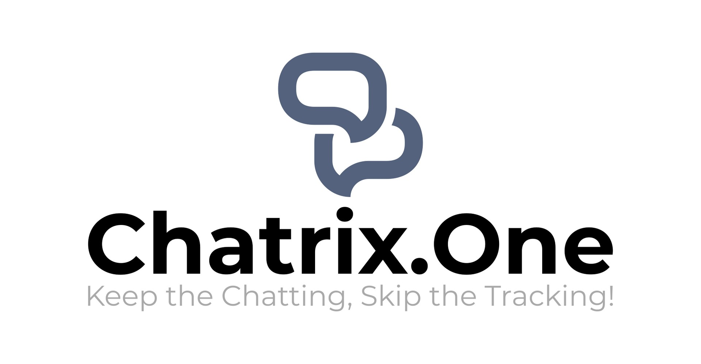

# Добре дошли

<figure markdown>
  { width="800" }
  <figcaption>Комуникирайте свободно, без телеметрия и без реклами!</figcaption>
</figure>

Здравейте и добре дошли в **Chatrix.One**! **XMPP** сървър за безплатна, криптирана от край до край комуникация, без телеметрия и без реклами. Изпращайте свободно съобщения, емотикони, снимки и файлове. Насладете се на качествена гласова комуникация и видео в реално време. Пожелавам Ви приятни мигове с вашето семейство, близки и приятели!

## Защо **Chatrix.One?**

- Използва утвърдена [**XMPP**](https://xmpp.org/about/technology-overview/) технология;
- **НЕ** изисква лични данни при регистрация;
- **НЕ** се интересува от личната комуникация;
- **НЕ** подлага на анализ съобщения, снимки и файлове;
- **НЕ** търгува с комуникацията и личните данни на потребителите;
- **НЕ** досажда с реклами, банери и оферти;
- **НЕ** изисква съгласие и приемане на безумна политика[^1];
- **ЦЕНИ** и **УВАЖАВА** личното пространство;
- Предоставя възможност за **криптиране от край до край**[^2];
- Базиран е на **Ejabberd**, софтуер с [**отворен код**](https://bg.wikipedia.org/wiki/Софтуер_с_отворен_код), който е достъпен в [Github](https://github.com/processone/ejabberd).

[^1]: *"Съгласен съм с правилата и условията за ползване"* **е [най-голямата лъжа в Интернет](https://www.biggestlieonline.com/)**!

[^2]: За криптиране от край до край е необходимо да активирате [**OMEMO**](https://docs.chatrix.one/често-задавани-въпроси/#omemo) във Вашия **XMPP** клиент.

## Как да използвам **Chatrix.One**?

За удобство на потребителите са достъпни следните статии:

- [Регистрация](https://docs.chatrix.one/регистрация/)

- [Необходим софтуер (клиенти)](https://docs.chatrix.one/клиенти/)

- [Често задавани въпроси](https://docs.chatrix.one/често-задавани-въпроси/)

- [Поверителност](https://docs.chatrix.one/поверителност/)
